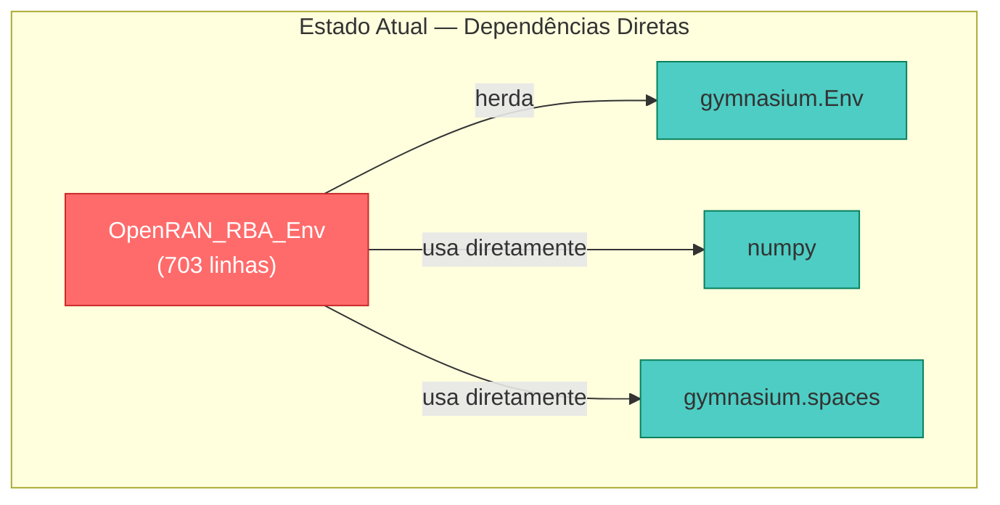
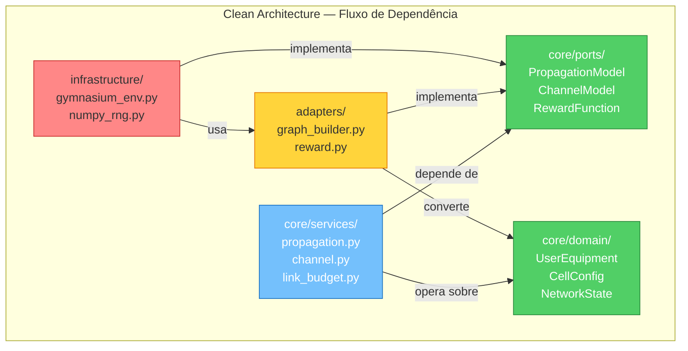

# Clean Architecture — Refatoração do `OpenRAN_RBA_Env`

## Contexto

O arquivo monolítico [openran_rba_env.py](file:///Users/alex/Documents/projetos/GRAMS-Env/openran_rba_env.py) (703 linhas) contém **todas** as responsabilidades do sistema em uma única classe `OpenRAN_RBA_Env`. Este plano propõe uma refatoração rigorosa para Clean Architecture, separando domínio de telecomunicações, orquestração de RL e infraestrutura de frameworks.

---

## 1. Diagnóstico de Acoplamento (Code Review)

### 1.1 Violações do Princípio da Responsabilidade Única (SRP)

A classe `OpenRAN_RBA_Env` acumula **7 responsabilidades distintas** em um único arquivo:

| # | Responsabilidade | Linhas | Evidência |
|---|---|---|---|
| 1 | **Entidade UE** (posição, velocidade, fila, CBR) | L136–146 | 10 arrays `self._ue_*` como atributos soltos — sem encapsulamento |
| 2 | **Física 3GPP** (path loss LOS/NLOS, shadowing) | L360–496 | `_calculate_pathloss_direct`, `_calculate_pathloss_inter_ue`, `_los_probability` |
| 3 | **Modelo de canal** (ganho direto + interferência + fading) | L498–540 | `_update_channel_gains` mistura path loss + shadowing + Rayleigh |
| 4 | **Mobilidade** (random walk com reflexão) | L317–354 | `_update_mobility` manipula arrays internos |
| 5 | **Tráfego CBR** (geração de pacotes) | L546–553 | `_generate_traffic` |
| 6 | **Lógica de enlace** (SINR, Shannon, alocação) | L559–595, L271–294 | `_compute_sinr` + lógica de Shannon inline no `step()` |
| 7 | **Interface Gymnasium** (spaces, reset, step, render) | L80–133, L151–311 | Herança de `gym.Env`, `spaces.MultiDiscrete`, `spaces.Dict` |

> [!CAUTION]
> Uma única modificação na fórmula de path loss (ex: migrar de UMa para UMi) exige editar a mesma classe que gerencia os `gymnasium.spaces`. Qualquer refatoração futura do observation space (ex: adicionar edge_features para a GNN) pode acidentalmente quebrar as equações de propagação.

### 1.2 Violações do Princípio da Inversão de Dependência (DIP)



**Acoplamentos concretos identificados:**

| Local | Regra de Domínio | Framework Acoplado | Violação |
|---|---|---|---|
| [L44–78](file:///Users/alex/Documents/projetos/GRAMS-Env/openran_rba_env.py#L44-L78) | Constantes 3GPP (freq, potência, raio) | Atributos de classe de `gym.Env` | Parâmetros de telecom são **atributos de infraestrutura** |
| [L114–116](file:///Users/alex/Documents/projetos/GRAMS-Env/openran_rba_env.py#L114-L116) | Semântica da ação (alocar K RBs a V UEs) | `spaces.MultiDiscrete`, `np.full` | Regra de negócio codificada como tipo Gymnasium |
| [L274–278](file:///Users/alex/Documents/projetos/GRAMS-Env/openran_rba_env.py#L274-L278) | Capacidade de Shannon: `B·log₂(1+SINR)·TTI` | `np.log2`, `np.where` inline no `step()` | Equação física embutida no fluxo de controle do framework |
| [L437–456](file:///Users/alex/Documents/projetos/GRAMS-Env/openran_rba_env.py#L437-L456) | Path Loss 3GPP TR 36.873 | `np.log10`, `np.where`, `np.clip` | Modelo de propagação depende de numpy diretamente |
| [L519–521](file:///Users/alex/Documents/projetos/GRAMS-Env/openran_rba_env.py#L519-L521) | Rayleigh Fading: \|h\|² ~ Exp(1) | `rng.exponential` (numpy Generator) | Distribuição estatística acoplada ao RNG do Gymnasium |
| [L619–625](file:///Users/alex/Documents/projetos/GRAMS-Env/openran_rba_env.py#L619-L625) | Observação como grafo (node_features + adj) | `np.column_stack`, `np.float32` | Adaptação de domínio→grafo misturada com numpy |

> [!IMPORTANT]
> **Consequência prática**: é impossível testar as equações de Shannon ou o modelo 3GPP de path loss sem instanciar um `gymnasium.Env` completo. Também é impossível reutilizar o modelo de canal em um simulador ns-3 ou em um benchmark com PyTorch puro sem arrastar todo o gymnasium como dependência.

### 1.3 Resumo do Diagnóstico

```
┌─────────────────────────────────────────────────────────────┐
│                    openran_rba_env.py                        │
│                                                             │
│  ┌─────────┐  ┌───────────┐  ┌─────────┐  ┌────────────┐  │
│  │ Entidade│  │  Física   │  │  Canal   │  │ Gymnasium  │  │
│  │   UE    │←→│  3GPP     │←→│  Rádio   │←→│  Env       │  │
│  │         │  │           │  │          │  │            │  │
│  └─────────┘  └───────────┘  └─────────┘  └────────────┘  │
│       ↕            ↕              ↕              ↕         │
│  ┌─────────┐  ┌───────────┐  ┌─────────┐  ┌────────────┐  │
│  │Mobilid. │  │  Shannon  │  │Tráfego  │  │  Reward    │  │
│  │         │←→│           │←→│  CBR    │←→│            │  │
│  └─────────┘  └───────────┘  └─────────┘  └────────────┘  │
│                                                             │
│            TUDO ACOPLADO — SEM FRONTEIRAS                   │
└─────────────────────────────────────────────────────────────┘
```

---

## 2. Estrutura de Diretórios Proposta

```
GRAMS-Env/
├── grams_env/
│   ├── __init__.py
│   │
│   ├── core/                          # ← CAMADA DE DOMÍNIO (zero deps externas)
│   │   ├── __init__.py
│   │   │
│   │   ├── domain/                    # Entidades puras (@dataclass)
│   │   │   ├── __init__.py
│   │   │   ├── cell.py                # CellConfig dataclass
│   │   │   ├── user_equipment.py      # UserEquipment dataclass
│   │   │   ├── resource_block.py      # ResourceBlock dataclass
│   │   │   └── network_state.py       # NetworkState (snapshot do TTI)
│   │   │
│   │   ├── services/                  # Lógica de domínio pura (equações)
│   │   │   ├── __init__.py
│   │   │   ├── propagation.py         # PathLossModel (3GPP TR 36.873)
│   │   │   ├── channel.py             # ChannelGainCalculator
│   │   │   ├── link_budget.py         # SINRCalculator, ShannonCapacity
│   │   │   ├── mobility.py            # MobilityModel (random walk)
│   │   │   └── traffic.py             # TrafficGenerator (CBR)
│   │   │
│   │   └── ports/                     # Interfaces (ABC) — contratos
│   │       ├── __init__.py
│   │       ├── propagation_port.py    # PropagationModel (ABC)
│   │       ├── channel_port.py        # ChannelModel (ABC)
│   │       ├── reward_port.py         # RewardFunction (ABC)
│   │       └── rng_port.py            # RandomNumberGenerator (ABC)
│   │
│   ├── adapters/                      # ← CAMADA DE ADAPTAÇÃO
│   │   ├── __init__.py
│   │   ├── graph_builder.py           # NetworkState → node_features + adj_matrix
│   │   └── reward.py                  # ThroughputQueueReward (implementa RewardFunction)
│   │
│   └── infrastructure/                # ← CAMADA DE INFRAESTRUTURA
│       ├── __init__.py
│       ├── gymnasium_env.py           # OpenRAN_RBA_Env(gym.Env) — wrapper fino
│       └── numpy_rng.py              # NumpyRNG (implementa RandomNumberGenerator)
│
├── tests/
│   ├── __init__.py
│   ├── test_propagation.py            # Testa path loss SEM gymnasium
│   ├── test_link_budget.py            # Testa SINR/Shannon SEM gymnasium
│   ├── test_graph_builder.py          # Testa adaptador de grafo
│   └── test_gymnasium_env.py          # Teste de integração (gym + domínio)
│
├── openran_rba_env.py                 # [LEGACY] será substituído
├── pyproject.toml
└── README.md
```

### Regra de Dependência (Dependency Rule)



> **Flecha = "depende de"**. O domínio não aponta para nada externo. A infraestrutura depende de tudo, mas ninguém depende dela.

---

## 3. Proposta de Implementação — Código Antes vs. Depois

### 3.1 Entidades de Domínio (core/domain/)

#### [NEW] `core/domain/cell.py`

```python
"""Configuração da célula — parâmetros físicos 3GPP puros."""

from __future__ import annotations

from dataclasses import dataclass


@dataclass(frozen=True)
class CellConfig:
    """Parâmetros físicos da célula, imutáveis por episódio.

    Todos os valores seguem 3GPP TR 36.873, Table 7.2-1.
    Sem dependências de numpy, gymnasium ou qualquer framework.
    """

    carrier_freq_ghz: float = 2.0
    bandwidth_mhz: float = 10.0
    num_rbs: int = 50
    rb_bandwidth_hz: float = 180_000.0
    gnb_tx_power_dbm: float = 46.0
    ue_tx_power_dbm: float = 23.0
    noise_floor_dbm_per_hz: float = -174.0
    cell_radius_m: float = 500.0
    min_distance_m: float = 35.0
    gnb_height_m: float = 25.0
    ue_height_m: float = 1.5
    street_width_m: float = 20.0
    building_height_m: float = 20.0
    tti_s: float = 1e-3
    sinr_threshold_db: float = 14.8

    @property
    def gnb_tx_power_w(self) -> float:
        """Potência de transmissão do gNB em Watts."""
        return 10 ** ((self.gnb_tx_power_dbm - 30) / 10)

    @property
    def noise_w(self) -> float:
        """Potência de ruído por RB em Watts."""
        n0 = 10 ** ((self.noise_floor_dbm_per_hz - 30) / 10)
        return n0 * self.rb_bandwidth_hz

    @property
    def sinr_threshold_linear(self) -> float:
        """Limiar SINR em escala linear."""
        return 10 ** (self.sinr_threshold_db / 10)

    @property
    def delta_h(self) -> float:
        """Diferença de alturas gNB − UE para cálculo de d_3D."""
        return self.gnb_height_m - self.ue_height_m
```

#### [NEW] `core/domain/user_equipment.py`

```python
"""Entidade User Equipment — estado e perfil de cada UE."""

from __future__ import annotations

from dataclasses import dataclass, field


@dataclass
class UserEquipment:
    """Representa um UE com estado mutável a cada TTI.

    Atributos puramente descritivos — sem lógica de framework.
    """

    ue_id: int
    x: float = 0.0                       # posição X (metros)
    y: float = 0.0                       # posição Y (metros)
    speed_m_s: float = 0.0               # velocidade (m/s)
    direction_rad: float = 0.0           # direção (radianos)
    cbr_bytes: float = 1000.0            # carga CBR por TTI
    queue_bits: float = 0.0              # fila pendente (bits)
    direct_gain: float = 0.0             # ganho direto linear
    is_los: bool = False                 # estado LOS/NLOS
    shadowing_db: float = 0.0            # shadowing (fixo por episódio)

    @property
    def distance_to_gnb(self) -> float:
        """Distância 2D do UE ao gNB (gNB na origem)."""
        return (self.x**2 + self.y**2) ** 0.5
```

#### [NEW] `core/domain/network_state.py`

```python
"""Snapshot do estado da rede em um TTI — Value Object imutável."""

from __future__ import annotations

from dataclasses import dataclass

import numpy as np


@dataclass(frozen=True)
class NetworkState:
    """Estado completo da rede em um TTI, para consumo pelos serviços.

    Nota: numpy é usado aqui como tipo de dado matricial (Value Object),
    NÃO como lógica computacional. É equivalente a uma "list of floats"
    performática. As operações matemáticas ficam nos Services.
    """

    positions: np.ndarray             # (V, 2)
    speeds: np.ndarray                # (V,)
    directions: np.ndarray            # (V,)
    queues: np.ndarray                # (V,)
    cbr_bytes: np.ndarray             # (V,)
    direct_gains: np.ndarray          # (V,)
    interference_gains: np.ndarray    # (V, V)
    is_los: np.ndarray                # (V,) bool

    @property
    def num_ues(self) -> int:
        return len(self.queues)
```

---

### 3.2 Interfaces / Ports (core/ports/)

#### [NEW] `core/ports/propagation_port.py`

```python
"""Contrato abstrato para modelos de propagação."""

from __future__ import annotations

from abc import ABC, abstractmethod

import numpy as np


class PropagationModel(ABC):
    """Interface para cálculo de path loss.

    Qualquer modelo 3GPP (UMa, UMi, InH) pode implementar
    esta interface sem alterar os serviços que a consomem.
    """

    @abstractmethod
    def path_loss_direct_db(
        self,
        d_2d: np.ndarray,
        is_los: np.ndarray,
    ) -> np.ndarray:
        """Calcula o path loss gNB→UE em dB.

        Parameters
        ----------
        d_2d : np.ndarray
            Distância 2D (V,) em metros.
        is_los : np.ndarray
            Estado LOS de cada UE (V,).

        Returns
        -------
        np.ndarray
            Path loss em dB (V,).
        """
        ...

    @abstractmethod
    def path_loss_inter_ue_db(
        self,
        dist_matrix: np.ndarray,
    ) -> np.ndarray:
        """Calcula o path loss entre pares de UEs em dB.

        Parameters
        ----------
        dist_matrix : np.ndarray
            Matriz de distâncias (V, V) em metros.

        Returns
        -------
        np.ndarray
            Path loss em dB (V, V).
        """
        ...

    @abstractmethod
    def los_probability(self, d_2d: np.ndarray) -> np.ndarray:
        """Probabilidade de LOS com base na distância."""
        ...
```

#### [NEW] `core/ports/reward_port.py`

```python
"""Contrato abstrato para funções de recompensa."""

from __future__ import annotations

from abc import ABC, abstractmethod

import numpy as np


class RewardFunction(ABC):
    """Interface para cálculo de recompensa.

    Permite trocar a função de reward (ex: throughput puro,
    fairness de Jain, penalidade de delay) sem alterar o step().
    """

    @abstractmethod
    def compute(
        self,
        real_throughput: np.ndarray,
        queues: np.ndarray,
    ) -> float:
        """Calcula a recompensa escalar do TTI.

        Parameters
        ----------
        real_throughput : np.ndarray
            Throughput real por UE (V,) em bits.
        queues : np.ndarray
            Filas residuais por UE (V,) em bits.

        Returns
        -------
        float
            Recompensa escalar.
        """
        ...
```

---

### 3.3 Serviços de Domínio (core/services/)

#### [NEW] `core/services/propagation.py` — **Antes vs Depois**

**ANTES** — acoplado dentro de `OpenRAN_RBA_Env` (linhas 401–496):

```python
# ❌ Método da classe gym.Env — impossível testar sem gymnasium
def _calculate_pathloss_direct(self, d_2d: np.ndarray) -> np.ndarray:
    d_2d_safe = np.clip(d_2d, 10.0, None)
    d_3d = np.sqrt(d_2d_safe**2 + self._delta_h**2)  # ← acessa self._delta_h
    f_c = self.CARRIER_FREQ_GHZ   # ← constante de classe gym.Env
    h_bs = self.GNB_HEIGHT_M      # ← constante de classe gym.Env
    # ... 20 linhas de equações acopladas a self
```

**DEPOIS** — serviço puro com DI:

```python
"""Modelo de propagação 3GPP TR 36.873 UMa — domínio puro."""

from __future__ import annotations

import math

import numpy as np

from grams_env.core.domain.cell import CellConfig
from grams_env.core.ports.propagation_port import PropagationModel


class TR36873_UMa(PropagationModel):
    """Implementação do path loss UMa conforme 3GPP TR 36.873.

    Recebe CellConfig via injeção de dependência. Sem herança
    de gymnasium, sem estado mutável, 100% testável isoladamente.
    """

    def __init__(self, config: CellConfig) -> None:
        self._cfg = config

    def los_probability(self, d_2d: np.ndarray) -> np.ndarray:
        d = np.clip(d_2d, 1.0, None)
        return (
            np.minimum(18.0 / d, 1.0) * (1 - np.exp(-d / 63))
            + np.exp(-d / 63)
        )

    def path_loss_direct_db(
        self,
        d_2d: np.ndarray,
        is_los: np.ndarray,
    ) -> np.ndarray:
        c = self._cfg
        d_safe = np.clip(d_2d, 10.0, None)
        d_3d = np.sqrt(d_safe**2 + c.delta_h**2)

        pl_los = (
            22.0 * np.log10(d_3d)
            + 28.0
            + 20.0 * np.log10(c.carrier_freq_ghz)
        )

        pl_nlos = (
            161.04
            - 7.1 * np.log10(c.street_width_m)
            + 7.5 * np.log10(c.building_height_m)
            - (24.37 - 3.7 * (c.building_height_m / c.gnb_height_m) ** 2)
            * np.log10(c.gnb_height_m)
            + (43.42 - 3.1 * np.log10(c.gnb_height_m))
            * (np.log10(d_3d) - 3)
            + 20.0 * np.log10(c.carrier_freq_ghz)
            - (3.2 * (np.log10(17.625)) ** 2 - 4.97)
            - 0.6 * (c.ue_height_m - 1.5)
        )

        return np.where(is_los, pl_los, np.maximum(pl_los, pl_nlos))

    def path_loss_inter_ue_db(
        self, dist_matrix: np.ndarray
    ) -> np.ndarray:
        c = self._cfg
        d = np.clip(dist_matrix, 1.0, None)

        return (
            161.04
            - 7.1 * np.log10(c.street_width_m)
            + 7.5 * np.log10(c.building_height_m)
            - (24.37 - 3.7 * (c.building_height_m / c.gnb_height_m) ** 2)
            * np.log10(c.gnb_height_m)
            + (43.42 - 3.1 * np.log10(c.gnb_height_m))
            * (np.log10(d) - 3)
            + 20.0 * np.log10(c.carrier_freq_ghz)
            - (3.2 * (np.log10(17.625)) ** 2 - 4.97)
            - 0.6 * (c.ue_height_m - 1.5)
        )
```

> [!TIP]
> **Teste unitário SEM gymnasium**: basta instanciar `TR36873_UMa(CellConfig())` e chamar `path_loss_direct_db(np.array([100.0]), np.array([True]))`. Zero dependência de `gym.Env`.

#### [NEW] `core/services/link_budget.py` — **Antes vs Depois**

**ANTES** — equação de Shannon inline no `step()` (linhas 271–285):

```python
# ❌ Lógica de Shannon embutida no fluxo de controle do gym.Env
capacity_per_rb = np.where(
    sinr_above,
    self.RB_BANDWIDTH_HZ * np.log2(1.0 + sinr_per_ue) * self.TTI_S,
    0.0,
)
rbs_per_ue = np.bincount(action, minlength=self.num_ues).astype(np.float64)
total_capacity = capacity_per_rb * rbs_per_ue
```

**DEPOIS** — serviço de domínio puro:

```python
"""Cálculo de SINR e capacidade de Shannon — domínio puro."""

from __future__ import annotations

import numpy as np

from grams_env.core.domain.cell import CellConfig


class LinkBudget:
    """Serviço de cálculo de enlace: SINR e capacidade Shannon.

    Recebe CellConfig via DI. Sem estado mutável, sem gymnasium.
    """

    def __init__(self, config: CellConfig) -> None:
        self._cfg = config

    def compute_sinr(
        self,
        direct_gains: np.ndarray,
        active_mask: np.ndarray,
    ) -> np.ndarray:
        """SINR = P_tx × g_direct / N  para UEs ativos."""
        return np.where(
            active_mask,
            self._cfg.gnb_tx_power_w * direct_gains / self._cfg.noise_w,
            0.0,
        )

    def shannon_capacity_bits(
        self,
        sinr: np.ndarray,
        num_rbs_per_ue: np.ndarray,
    ) -> np.ndarray:
        """C = B · log₂(1 + SINR) · TTI × num_rbs   [bits/TTI].

        Aplica o limiar de SINR: se SINR < limiar, C = 0.
        """
        above = sinr >= self._cfg.sinr_threshold_linear
        per_rb = np.where(
            above,
            self._cfg.rb_bandwidth_hz
            * np.log2(1.0 + sinr)
            * self._cfg.tti_s,
            0.0,
        )
        return per_rb * num_rbs_per_ue
```

---

### 3.4 Adaptador de Grafo (adapters/)

#### [NEW] `adapters/graph_builder.py`

```python
"""Adaptador: converte NetworkState → observação de grafo para GNN."""

from __future__ import annotations

from dataclasses import dataclass

import numpy as np

from grams_env.core.domain.network_state import NetworkState


@dataclass(frozen=True)
class GraphObservation:
    """Estrutura de grafo para consumo pela GNN.

    Desacoplada do gymnasium — pode ser consumida por
    PyTorch Geometric, DGL, ou qualquer outro framework.
    """

    node_features: np.ndarray       # (V, 3) float32
    adjacency_matrix: np.ndarray    # (V, V) float32


class GraphBuilder:
    """Converte um NetworkState em GraphObservation.

    Responsabilidade única: serialização de domínio → grafo.
    """

    def build(self, state: NetworkState) -> GraphObservation:
        cqi = 10 * np.log10(state.direct_gains + 1e-20) + 200

        node_features = np.column_stack([
            cqi,
            state.queues,
            state.cbr_bytes,
        ]).astype(np.float32)

        adjacency_matrix = state.interference_gains.astype(np.float32)

        return GraphObservation(
            node_features=node_features,
            adjacency_matrix=adjacency_matrix,
        )
```

---

### 3.5 Infraestrutura — Gymnasium Env como Wrapper Fino

#### [NEW] `infrastructure/gymnasium_env.py` — **Antes vs Depois**

**ANTES** — 703 linhas com tudo misturado.

**DEPOIS** — wrapper fino que delega para os serviços:

```python
"""Wrapper Gymnasium — camada fina de infraestrutura."""

from __future__ import annotations

from typing import Any

import gymnasium as gym
import numpy as np
from gymnasium import spaces

from grams_env.adapters.graph_builder import GraphBuilder
from grams_env.adapters.reward import ThroughputQueueReward
from grams_env.core.domain.cell import CellConfig
from grams_env.core.services.channel import ChannelGainCalculator
from grams_env.core.services.link_budget import LinkBudget
from grams_env.core.services.mobility import MobilityModel
from grams_env.core.services.propagation import TR36873_UMa
from grams_env.core.services.traffic import CBRTrafficGenerator


class OpenRAN_RBA_Env(gym.Env):
    """Wrapper Gymnasium fino — toda lógica delegada aos serviços.

    Esta classe NÃO contém equações de Shannon, path loss,
    ou qualquer regra de telecom. Apenas:
      1. Define action_space / observation_space (Gymnasium).
      2. Orquestra os serviços no step().
      3. Converte resultados para o formato Gymnasium.
    """

    metadata: dict[str, Any] = {"render_modes": ["human"]}

    def __init__(
        self,
        num_ues: int = 10,
        config: CellConfig | None = None,
    ) -> None:
        super().__init__()

        self.num_ues = num_ues
        self.config = config or CellConfig()

        # Injeção de dependência dos serviços de domínio
        propagation = TR36873_UMa(self.config)
        self._channel = ChannelGainCalculator(self.config, propagation)
        self._link = LinkBudget(self.config)
        self._mobility = MobilityModel(self.config)
        self._traffic = CBRTrafficGenerator()
        self._graph = GraphBuilder()
        self._reward_fn = ThroughputQueueReward(weight=1e-4)

        # Espaços Gymnasium (ÚNICO local com dependência de gymnasium)
        self.action_space = spaces.MultiDiscrete(
            np.full(self.config.num_rbs, num_ues, dtype=np.int64)
        )
        self.observation_space = spaces.Dict({
            "node_features": spaces.Box(
                0.0, np.inf, (num_ues, 3), np.float32
            ),
            "adjacency_matrix": spaces.Box(
                0.0, np.inf, (num_ues, num_ues), np.float32
            ),
        })

        self._state = None  # NetworkState

    def reset(self, *, seed=None, options=None):
        super().reset(seed=seed)
        rng = self.np_random
        # ... delega para serviços (mobility, channel, traffic)
        # ... retorna GraphBuilder.build(state) convertido para dict

    def step(self, action):
        rng = self.np_random
        # 1. self._mobility.update(state, rng)
        # 2. self._channel.update_gains(state, rng)
        # 3. self._traffic.generate(state)
        # 4. sinr = self._link.compute_sinr(...)
        # 5. capacity = self._link.shannon_capacity_bits(...)
        # 6. reward = self._reward_fn.compute(...)
        # 7. obs = self._graph.build(state)
        # ... retorna (obs_dict, reward, False, False, info)
```

---

## 4. Verificação e Testes

### 4.1 Testes Unitários de Domínio (sem gymnasium)

```python
# tests/test_propagation.py
def test_path_loss_los_at_100m():
    """Path loss LOS a 100m deve estar entre 60-80 dB para 2 GHz."""
    config = CellConfig()
    model = TR36873_UMa(config)
    d = np.array([100.0])
    is_los = np.array([True])
    pl = model.path_loss_direct_db(d, is_los)
    assert 60.0 < pl[0] < 80.0

def test_shannon_zero_below_threshold():
    """Shannon deve retornar 0 quando SINR < limiar."""
    config = CellConfig()
    lb = LinkBudget(config)
    sinr = np.array([1.0])  # ~0 dB, abaixo do limiar 14.8 dB
    capacity = lb.shannon_capacity_bits(sinr, np.array([5.0]))
    assert capacity[0] == 0.0
```

### 4.2 Teste de Integração (com gymnasium)

```python
# tests/test_gymnasium_env.py
def test_env_dimensions():
    """Shapes das observações devem corresponder ao observation_space."""
    env = OpenRAN_RBA_Env(num_ues=10)
    obs, _ = env.reset(seed=42)
    assert obs["node_features"].shape == (10, 3)
    assert obs["adjacency_matrix"].shape == (10, 10)
```

### 4.3 Comandos de Verificação

```bash
# Rodar todos os testes
pytest tests/ -v

# Rodar só domínio (zero deps de gymnasium)
pytest tests/test_propagation.py tests/test_link_budget.py -v

# Verificar que o env funciona end-to-end
python -m grams_env.infrastructure.gymnasium_env
```

---

## 5. Resumo de Arquivos

| Ação | Arquivo | Responsabilidade |
|---|---|---|
| **[NEW]** | `core/domain/cell.py` | Configuração física imutável |
| **[NEW]** | `core/domain/user_equipment.py` | Entidade UE |
| **[NEW]** | `core/domain/network_state.py` | Snapshot do TTI |
| **[NEW]** | `core/ports/propagation_port.py` | Interface de path loss |
| **[NEW]** | `core/ports/reward_port.py` | Interface de reward |
| **[NEW]** | `core/services/propagation.py` | 3GPP TR 36.873 UMa |
| **[NEW]** | `core/services/channel.py` | Ganhos + fading |
| **[NEW]** | `core/services/link_budget.py` | SINR + Shannon |
| **[NEW]** | `core/services/mobility.py` | Random walk |
| **[NEW]** | `core/services/traffic.py` | CBR generator |
| **[NEW]** | `adapters/graph_builder.py` | Estado → Grafo GNN |
| **[NEW]** | `adapters/reward.py` | Throughput − penalty |
| **[NEW]** | `infrastructure/gymnasium_env.py` | Wrapper `gym.Env` |
| **[NEW]** | `infrastructure/numpy_rng.py` | Adapter RNG |
| **[DELETE]** | `openran_rba_env.py` | Monólito legado |

---

## Resumo das Decisões do Usuário (Open Questions)

1. **Retrocompatibilidade**: **NÃO**. Não criaremos alias de import. Os scripts antigos precisarão ser atualizados para o novo path (`from grams_env.infrastructure.gymnasium_env import OpenRAN_RBA_Env`).
2. **Uso de Numpy**: **SIM (Pragmatismo)**. Vamos manter o uso de `numpy` no domínio (ex: `NetworkState`) para garantir máxima performance vetorial, priorizando velocidade sobre pureza arquitetural estrita.
3. **Estratégia de Implementação**: **Big Bang**. Todos os 15+ arquivos da nova arquitetura serão implementados de uma única vez.
